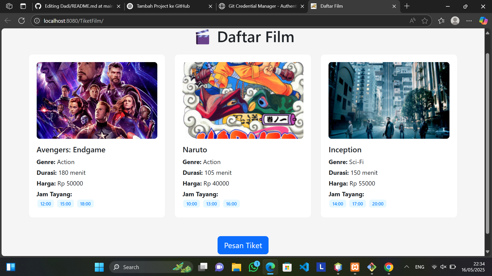
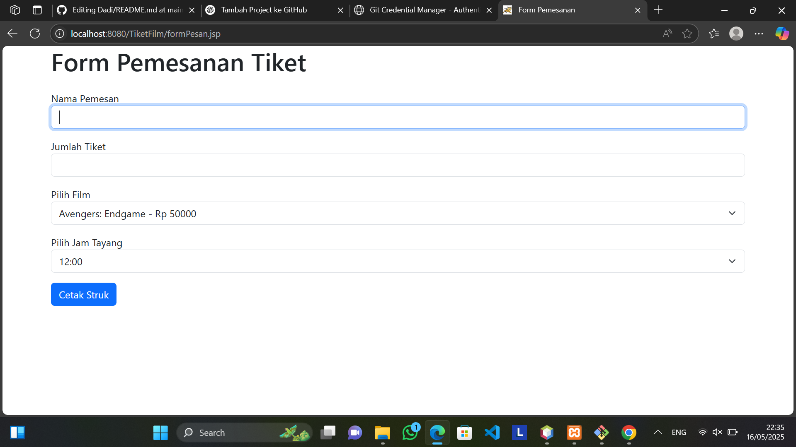
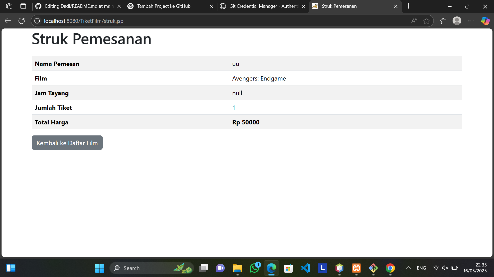

📽️ UTS - Aplikasi Pemesanan Tiket Bioskop (JSP)
✏️ Deskripsi Project
Proyek ini merupakan aplikasi web sederhana berbasis JSP (Java Server Pages) yang memungkinkan pengguna untuk melihat daftar film dan melakukan pemesanan tiket bioskop tanpa menggunakan database.

Aplikasi ini terdiri dari beberapa halaman utama:

index.jsp — Halaman selamat datang atau pengantar

daftarFilm.jsp — Menampilkan daftar film lengkap beserta genre, durasi, harga tiket, dan jam tayang

formPesan.jsp — Formulir pemesanan tiket oleh pengguna

struk.jsp — Menampilkan ringkasan pemesanan sebagai struk

Data film disimpan sementara menggunakan session tanpa koneksi ke database.

### 🎞️ Halaman Index (Daftar Film)

### 📝 Halaman Form Pemesanan

### 📄 Halaman Struk

🛠️ Instruksi Cara Menjalankan Aplikasi
Persiapan Environment:

Gunakan IDE seperti Apache NetBeans atau Eclipse dengan Apache Tomcat.

Pastikan JDK sudah terinstall.

Struktur Folder:

Tempatkan semua file .jsp di dalam folder web atau webapp.

Buat class Film di dalam package Tiket (misalnya src/Tiket/Film.java).
